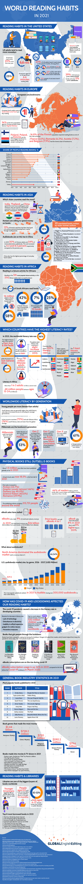
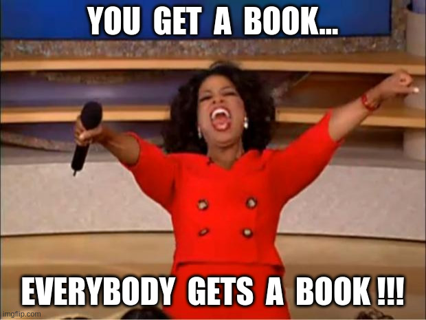

# Freedom of Critical Knowledge Act (FoCKA)

> In the words of Charlie Munger, “take a simple idea and take it seriously.”

Yes, I am doing prompt-engineering on you here... ;)

## The Idea
What if some books, deemed to be valuable to the future of humanity, were expropriated with fair/handsome compensation to the authors/publishers/copyright holders and made freely available under the [Creative Commons Public Domain License](https://creativecommons.org/publicdomain/zero/1.0/) or [MIT License](https://en.wikipedia.org/wiki/MIT_License) for all of humanity.

Nearly 50% of the people in the world are living below the [$6.85 per day poverty line](https://devinit.org/resources/poverty-trends-global-regional-and-national/).
How will they ever get access to great books? What if in one of those minds were the solution to one of Earth's many critical problems? All that needed was some kindling from a great book. Think: Srinivasa Ramanujan.

There are currently [6.5 billion](https://explodingtopics.com/blog/smartphone-stats) smartphones in use globally. If we put great books in the public domain, anybody could legally download and redistribute them. Students/hobbyists could do translations to other languages. University presses could even print cheap copies.
If we take away cost considerations, it will lower the barrier to entry into peoples minds.

> What an astonishing thing a book is. It’s a flat object made from a tree with flexible parts on which are imprinted lots of funny dark squiggles. But one glance at it and you’re inside the mind of another person, maybe somebody dead for thousands of years. Across the millennia, an author is speaking clearly and silently inside your head, directly to you. Writing is perhaps the greatest of human inventions, binding together people who never knew each other, citizens of distant epochs. Books break the shackles of time. A book is proof that humans are capable of working magic.
> 
   -- Carl Sagan, 1980

## In The Public Interest
Countries that read more have higher GDP values. It should then be obvious that weaker governments need to invest money to improve literacy and readership numbers. It is assumed that the quality of the reading material would also play a role. If we put high quality books in the public domain this would level the playing field and lower the investments needed by these governments. Think: growing the pie.

Global GDP is not a zero-sum game, is it?

[https://lectupedia.com/en/reading-and-gdp](https://lectupedia.com/en/reading-and-gdp)

 
## Quality over Quantity

[https://lectupedia.com/en/number-of-books-read-in-each-country/](https://lectupedia.com/en/number-of-books-read-in-each-country/)

We don't need to free that many books each year, 5 to 10 high quality books should be sufficient. We are aiming to apply an 80/20 rule here. We should optimize to get the most utility out of the least number of books (titles).

Think of it this way: All the time you spend reading something bad comes at the expense of reading something good. **Reading a great book twice is better than reading ten average ones.**

[https://fs.blog/reading/](https://fs.blog/reading/)  
[https://fs.blog/choose-your-next-book/](https://fs.blog/choose-your-next-book/)  

> In my whole life, I have known no wise people (over a broad subject matter area) who didn’t read all the time – none, zero.
> 
> -- Charlie Munger

## Optimize for Utility
We want to maximize on the overall utility/applicability of these books and not their marketed fashion/appeal. Inclusion on best-seller's lists is no guarantee of utility, applicability or quality just popularity. Curatorship should help here.

## Fiction vs. Non-fiction
~~It is my opinion that books with general appeal and "great impact on humanity" are most likely works of non-fiction.~~ I would however concede that fiction such as [George Orwell's 1984](https://gutenberg.net.au/ebooks01/0100021.txt)  would also have global impact. Further, I feel we should not target religious texts, as those should already be in the public domain and managed by their religious organizations.

> Imagination is more important than knowledge... -- Albert Einstein

Kids should expand their imagination, and thus consume copious amounts of science-fiction & fantasy.  We should free books for that demographic too.

## Available Time

[https://ourworldindata.org/time-use-living-conditions](https://ourworldindata.org/time-use-living-conditions)
[https://howlongtoread.com/](https://howlongtoread.com/)  

Reading and listening would come out of education and other leisure time. The average person has probably 15 minutes to an hour available per day for reading.

Learn from the Europeans, work/toil less and leisure more...

* James Joyce once said “Life is too short to read a bad book.”
* Life’s too short to finish books you don’t like.

## World Reading Habits

[https://geediting.com/world-reading-habits-in-2021-infographic/](https://geediting.com/world-reading-habits-in-2021-infographic/)
[https://www.statista.com/search/?q=reading](https://www.statista.com/search/?q=reading)

## Government Funding
This article is titled, Freedom of Critical Knowledge **Act**. However, I do not believe a special act is really needed. This could easily be done through normal/local budget allocation.

One government could use a small part of its education budget to free just one book a year. Doing this will make that book available to all other education departments around the world. Governments with smaller budgets could pool their resources to free more books.
One country could gift a book to the rest of the world, the gift that keeps on giving.
The next year it could be another country's turn.

If governments standardize on a single (highest quality) school curriculum and limit updates to it (say a 5 year cycle) all the required textbooks could be freed. These books can then be printed by more competitive printers (university printers for example).

[https://www.statista.com/statistics/741558/us-public-school-textbook-expenditure/](https://www.statista.com/statistics/741558/us-public-school-textbook-expenditure/)

> Do more and more with less and less until eventually you can do everything with nothing. -- R. Buckminster Fuller (Nine Chains to the Moon, 1938)

## Acts
To implement this idea we don't really need a new act. The "act" was just to make the FoCKA acronym more memorable ;). However, if we do create/enact an act it will give government institutions a mechanism to access budgets/funds and allow them to expropriate books. 

Around the world there exists a few acts that deal with the control of ideas/information and the expropriation of property.

### The Invention Secrecy Act of 1951
[https://en.wikipedia.org/wiki/Invention_Secrecy_Act](https://en.wikipedia.org/wiki/Invention_Secrecy_Act)

The Invention Secrecy Act of 1951 is a body of United States federal law designed to prevent disclosure of new inventions and technologies that, in the opinion of selected federal agencies, present a possible threat to the national security of the United States. 

A secrecy order bars the award of a patent, orders that the invention be kept secret, restricts the filing of foreign patents, and specifies procedures to prevent disclosure of ideas contained in the application. The only way an inventor can avoid the risk of such imposed secrecy is to forgo patent protection.

By the end of 1991, the number of patent secrecy orders stood at 6,193. Many such orders were imposed on individuals and organizations working without government support. This number shrank for each fiscal year thereafter, until 2002. Since 2002, the number of secrecy orders has grown, with 5,002 secrecy orders in effect at the end of fiscal year 2007.

If certain ideas pose a thread to national security and thus be made secret. It stands to reason that other ideas/information/books could have a critical/positive impact on humanity and so must be made free/public domain to maximize their dissemination.

### Freedom of Information Act
[https://www.foia.gov/](https://www.foia.gov/)

The basic function of the Freedom of Information Act is to ensure informed citizens, vital to the functioning of a democratic society.

## BBC - Billionaires Book Club
Some of the most influential people on earth read books that alter their perspective on life/humanity. They read many many books but filter them down to a select few that they then recommend to others. What if they took it one step further, instead of only recommending these books they also applied a bit of philanthropy, buy the books rights, and made it public domain as a gift to humanity.

> The word philanthropy comes from Ancient Greek φιλανθρωπία (philanthrōpía) 'love of humanity', from phil- 'love, fond of' and anthrōpos 'humankind, mankind'. In the second century AD.

This will have a measurable impact on mankind.

This could even become the [Ice Bucket Challenge](https://en.wikipedia.org/wiki/Ice_Bucket_Challenge) for billionaires.

* [Billionaires](https://www.mostrecommendedbooks.com/people)   (choose Categories -> Billionaire) 
* [South African Billionaires](https://dailyinvestor.com/business/12972/richest-south-africans-in-2023/)

 

## Cost to Buy Out Publishing Rights
[https://wordsrated.com/book-sales-statistics/](https://wordsrated.com/book-sales-statistics/)

Authors/publishers of great books put in a huge effort to produce high quality works. They need to be handsomely compensated but the free market does not always guarantee that.

> Authors have plenty of ways to make money, aside from selling their book. They can give talks, find new clients, consult, launch a product, become a coach, or build a personal brand. Of course, it’s great to have a book that sells a million copies, but that’s an extremely rare event.

What if you have a book with a billion+ readers? Isn't that bragging rights and validation for future endeavours?

<iframe width="560" height="315" src="https://www.youtube.com/embed/m-6mJtOWQt8?si=llrMo7rKZK5UCvOh" title="YouTube video player" frameborder="0" allow="accelerometer; autoplay; clipboard-write; encrypted-media; gyroscope; picture-in-picture; web-share" allowfullscreen></iframe>

Even thou a book might be in the public domain the author/publisher could still continue to sell it.

> Becoming a New York Times best-selling author doesn’t bring you lasting fulfillment, endless riches, or a lifetime of good health. It doesn’t actually sell that many books. But it is a flex, a status symbol. Land a spot on The List once, and it’s in your bio forever. It’s what journalist David Brooks calls a résumé virtue: an accolade that might bring fleeting excitement, but not enduring contentment.

[https://every.to/p/on-the-value-of-not-reaching-your-goals](https://every.to/p/on-the-value-of-not-reaching-your-goals)

### What Are Typical Rates for Book Royalties?
Royalty rates vary slightly, but on average, you can expect the following from traditional publishers:

* Hardcover sales: 15%
* Trade paperback sales: 7.5%
* Mass-market paperback sales: 5%
* eBook sales: 25%
* Audiobook sales: 25%

### Publisher's Costs
* Editing, Type-Setting, Printing
* Audiobook Recording
* eBook Creation
* Distribution
* Marketing
* Sales
* Storage
* Distribution
* Admin

### Design a Formula for Fair Compensation
It should be open and transparent. The formula should include the following:

* Current market demand.
* [Long tail](https://www.investopedia.com/terms/l/long-tail.asp) in sales.
* Total expected earnings/profits.
* An author's **quality bonus** for the books quality.
* Publisher's costs of producing the work(s) in question.
* An handsome/fair return on investment.

Other people/authors/publishers can come up with the formula. It is not in my wheelhouse.

### Kickstarter
If you are not a billionaire, talk to the author of the book and start a [Kickstarter](https://www.kickstarter.com/) campaign. Use social influencers / fan-clubs to spread your message far and wide. The risk is low, the book is already produced, the quality known. You just want to buy the rights and set it free.

## The List

This is my naive attempt at a first list. It should be a **curated list** but I am not yet sure who  the curator(s) should be. 

* a committee  -  design by committee, never a good idea, external influence
* a collection of luminaries   -  might be out of touch with the global audience
* billionaire philanthropists that pay for their favorite nominations to be free
* a Twitter/X/Reddit/Hacker News poll  -  loudest voices, active discussion
* social media influencers  -  never ;)  loud voices, external influence

By mentioning and publishing this list, these books' sales will spike making negotiations to free them more difficult...  oops.

  
  
Johann Hari

All over the world, our ability to pay attention is collapsing. In the US, college students now focus on one task for only 65 seconds, and office workers on average manage only three minutes. New York Times best-selling author Johann Hari went on an epic journey across the world to meet the leading scientists and experts investigating why this is happening to us – and discovered that everything we think we know on this subject is wrong.

We think our inability to focus is a personal failing – a flaw in each one of us. It is not. This has been done to us – by powerful external forces. Our focus has been stolen. Johann discovered there are twelve deep cases of this crisis, all of which have robbed some of our attention.

Twitter/X/Meta/Facebook/Instagram/Snapchat/TikTok there must be many ex-leaders/employees that wants to make amends for their negative influence on kids? Pool your resources and free this book.

  
  
Mo Gawdat

Solve for Happy is a startlingly original book about creating and maintaining happiness, written by a top Google executive with an engineer’s training and fondness for thoroughly analyzing a problem.

In 2001, Mo Gawdat, a remarkable thinker whose gifts had landed him top positions in half a dozen companies and who – in his spare time – had created significant wealth, realized that he was desperately unhappy. A lifelong learner, he attacked the problem as an engineer would, examining all the provable facts and scrupulously following logic. When he was finished, he had discovered the equation for enduring happiness.

Ten years later, that research saved him from despair when his college-aged son, Ali – also intellectually gifted – died during routine surgery. In dealing with the loss, Mo found his mission: he would pull off the type of ‘moonshot’ that he and his Google `[X]` colleagues were always aiming for: he would help ten million people become happier by pouring his happiness principles into a book and spreading its message around the world.

<iframe width="560" height="315" src="https://www.youtube.com/embed/csA9YhzYvmk?si=P1BjUK6IgD9Tuvmr" title="YouTube video player" frameborder="0" allow="accelerometer; autoplay; clipboard-write; encrypted-media; gyroscope; picture-in-picture; web-share" allowfullscreen></iframe>

Google engineers unite! Don't be evil. Help Mo free his book and reach a billion people.
On second thought, I think [John Oliver](https://www.youtube.com/@LastWeekTonight) is the man to set this one free...  You can do it!

  
  
Nick Bostrom  
Professor at Oxford University, where he is the founding Director of the Future of Humanity Institute. 

> Elon Musk has warned that **artificial intelligence is ''one of the biggest threats'' to humanity**. This is because humans face the threat of being outsmarted by machines for the first time.

https://www.mostrecommendedbooks.com/elon-musk-books

Elon, this one could be right up your alley. Gift it to South Africa...

  
  
Greta Thunberg

> However, most of this pollution comes from just a few countries: China, for example, generates around 30% of all global emissions, while the United States is responsible for almost 14%.
> https://climatetrade.com/which-countries-are-the-worlds-biggest-carbon-polluters/

I guess China and America could offset a few carbon credits by freeing Greta's book.

  
  
Vaclav Smil

> "Another masterpiece from one of my favorite authors... If you want a brief but thorough education in numeric thinking about many of the fundamental forces that shape human life, this is the book to read. It's a tour de force" -- Bill Gates. 

I am looking at you Bill.  ;)

  
  
Benjamin Graham

> I read the first edition of this book early in 1950, when I was nine-teen. I thought then that it was by far the best book about investing ever written. I still think it is. To invest successfully over a lifetime does not require a stratospheric IQ, unusual business insights, or inside information. What’s needed is a sound intellectual framework for making decisions and the ability to keep emotions from corroding that framework. This book precisely and clearly prescribes the proper framework... -- Warren Buffet.

Warren, you know you want to, it will pay dividends it other ways.

Heck, all the people that got rich from the wisdom of this book should contribute towards its freedom. ;p  Maybe it will teach new investors to shun speculation in zero-sum games.

## Consequences
Imagine if the ideas contained in these books where to ruminate in the collective minds of humanity (the entire planet) at the same time. This will lead to increased conversations about these ideas/subjects, possibly solutions to problems and further action.

> "When you want to build a ship, do not begin by gathering wood, cutting boards, and distributing work, but awaken within the heart of man the desire for the vast and endless sea."
> 
> -- Antoine de Saint-Exupéry

## Should we do this?
Will this not instill group-think in humanity? (good/bad?)
I'll argue if it consolidate action towards Climate-Change / AGI issues it would be a good thing.

Diminishing diversity of ideas/thought?
That is also debatable, since given [Sturgeon's law](https://en.wikipedia.org/wiki/Sturgeon%27s_law) 90% is crap anyway. We are simply replacing some of those with higher quality ones ;)

Will greater public awareness not lead to greater public outcry for urgent action and thus lead us to sub-optimal solutions (local maxima)? Haste is the root of all evil.

 

